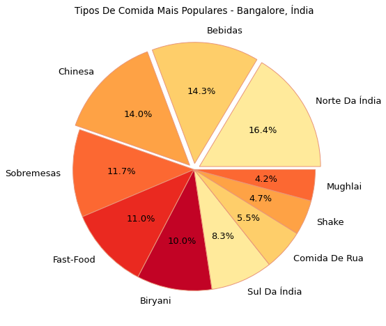
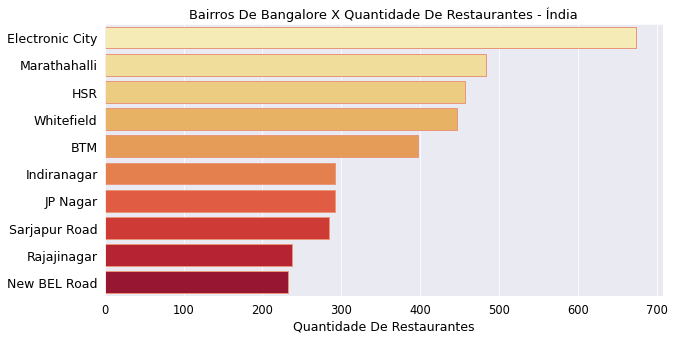
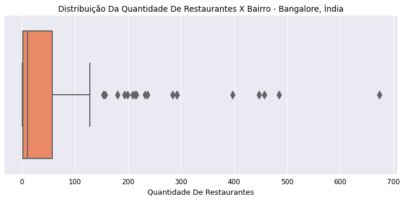
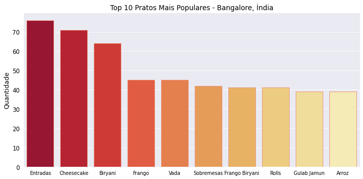
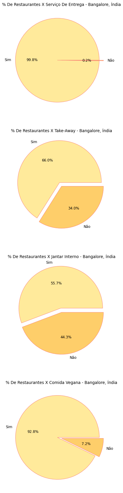

# Zomato (EDA)


Tal análise de dados irá expor uma exploração e explanação detalhada das informações presentes em um dataset do aplicativo Zomato, que é um dos aplicativos de pesquisa mais utilizados para a procura de bares e restaurantes em todos os países. 

Neste caso, o conjunto de dados do aplicativo Zomato estará restrito à cidade de Bangalore na Índia, assim às informações expostas se referem estritamente aos restaurantes, lanchonetes, bares e sorveterias dos bairros da cidade indiana. 

Um dos principais focos da análise é expor o quão bem os serviços alimentícios e secundários de tais estabelecimentos são avaliados pela região.

###### Obs :. As ferramentas utilizadas para tal análise foram a linguagem de programação Python, Pandas para a manipulação de dados, Matplotlib e Seaborn para a visualização gráfica dos dados informativos.

Antes de exportarmos o conjunto de dados, iremos exportar às bibliotecas que serão ferramentárias durante este processo de análise:

## Importação de Bibliotecas

```
import pandas as pd
import numpy as np
import matplotlib.pyplot as plt
import seaborn as sns
```
## Fonte de dados

O dataset [Zomato Bangalore Restaurants](https://www.kaggle.com/datasets/himanshupoddar/zomato-bangalore-restaurants) utilizado em tal análise exploratória está hospedado disponivelmente no Kaggle para uso gratuito.

## Importação do dataset

```
df_restaurantes = pd.read_csv('/content/drive/MyDrive/BangaloreZomatoData.csv')
```

Após importarmos a base de dados, verificamos a quantidade de linhas e colunas contidas em tal dataset pelo atributo .shape, e assim descobrimos que há 
8 mil e 923 linhas, e 19 colunas disponíveis para a exploração analítica.

## Colunas do dataset

Abaixo são os nomes das colunas que serão analisadas:

```
'name', 'url', 'tipo_de_comida', 'area', 'tempo', 'endereco_completo',
       'numero_tel', 'servico_de_entrega', 'take_away', 'jantar_interno',
       'comida_vegana', 'avaliacao_jantar', 'qtd_avaliacoes_jantar',
       'avaliacao_entrega', 'qtd_avaliacoes_entrega', 'conhecido_por',
       'pratos_populares', 'pessoas_conhecem_por', 'custo_medio'
``` 

## Processo de exploração dos dados

### **(1)** Tratamento dos dados

* Renomeação das colunas:

  **(1)** As colunas estavam originalmente escritas em inglês, para facilitar o entendimento informacional de cada coluna, os nomes das colunas foram traduzidos do inglês para o português em um formato mais entendível em relação ao que cada coluna trata.
  
* Dados nulos:

 **(1)** Foi verificável que às colunas tempo, conhecido_por, pratos_populares e pessoas_conhecem_por contêm dados nulos, neste caso não fizemos nada para sanar essa ausência de informações por não termos opções viáveis que facilitassem no preencimento de tais dados nulos.
 
 Basicamente, esses dados nulos significam que há restaurantes que foram registrados no dataset que não sabemos o horário comercial em que tais estabelecimentos estão abertos, há restaurantes em que não sabemos quais são os pratos popularmente mais pedidos, e também não sabemos às avaliações e os julgamentos dos clientes em relação à alguns restaurantes específicos da cidade de Bangalore.
 
### **(2)** Conhecimento exploratório dos dados

À partir desta fase, começamos à explorar em detalhes o conjunto de dados relativo aos restaurantes registrados na cidade de Bangalore pelo aplicativo Zomato, e primeiramente antes de inicializarmos com perguntas mais complexas sobre tal dataset, poderemos nos perguntar **(a)** quantos restaurantes e bairros estão dispersamente localizáveis na cidade de Bangalore? 

Para respondermos tal questão, utilizamos o método .nunique() para sabermos a quantidade de valores únicos em relação aos bairros e restaurantes, e disto descobrimos que há aproximadamente 5 mil e 242 restaurantes localizados na cidade de Bangalore e 169 bairros pela cidade em que tais restaurantes estão dispersos.

Tal questão simples nos fornece uma impressão inicial da vastidão de restaurantes que estão espaçados pela cidade indiana, e com tal informação fornecida podemos iniciar uma análise que seja centralizada nos costumes alimentícios dos indianos com base nos restaurantes que os habitantes frequentam:

#### **(1)** Quais são os tipos de comida mais populares na cidade de Bangalore na Índia?

A resposta desta questão foi obtida por um agrupamento de tipos de comida dos restaurantes, e uma contabilização do quão frequente esses tipos de comida são nos restaurantes da região, com tal resposta fornecida fizemos uma tabela que explicita os 10 pratos mais populares da cidade de Bangalore na Índia:

| tipos_de_comida | qtd  |
|-----------------|------|
|                 |      |
| North Indian    | 3249 |
| Beverages       | 2829 |
| Chinese         | 2765 |
| Desserts        | 2320 |
| Fast Food       | 2173 |
| Biryani         | 1987 |
| South Indian    | 1644 |
| Street Food     | 1089 |
| Shake           | 927  |
| Mughlai         | 826  |
|                 |      |

Para termos uma expressão mais visual e entendível de tal informação, podemos plotar um gráfico de pizza para representar a proporção do quão cada tipo de comida é popular nos restaurantes indianos:



Em suma, as culinárias norte-indianas e chinesas são os tipos de comida mais populares nos restaurantes de Bangalore na Índia, juntamente às comidas de rua, o fast-food, Biryani e às comidas sul-indianas são tipos de comida também populares nos restaurantes da cidade metropolitana da Índia.

Após tal exposição informacional, sabemos especulativamente quais são algumas das comidas mais populares e consumíveis na cidade indiana (bom, ao menos pelo que indica os dados dos restaurantes).

Como vimos anteriormente, há 169 bairros na cidade indiana com aproximadamente 5 mil restaurantes localmente dispersos entre os bairros da região, à partir desse dado simples, podemos nos perguntar:

#### **(2)** Quais são os bairros de Bangalore em que há mais restaurantes localizáveis?

O processo para responder tal questão foi congênere ao processo aplicável na questão anterior, agrupamos os bairros únicos da cidade indiana e contabilizamos a quantidade de restaurantes localizadas em cada bairro, assim obtivemos uma tabela e a organizamos com os 10 bairros com mais restaurantes localizados em Bangalore:

| index | area                       | qtd_restaurantes |
|-------|----------------------------|------------------|
| 0     | Electronic City, Bangalore | 674              |
| 1     | Marathahalli, Bangalore    | 484              |
| 2     | HSR, Bangalore             | 457              |
| 3     | Whitefield, Bangalore      | 447              |
| 4     | BTM, Bangalore             | 397              |
| 5     | Indiranagar, Bangalore     | 292              |
| 6     | JP Nagar, Bangalore        | 292              |
| 7     | Sarjapur Road, Bangalore   | 284              |
| 8     | Rajajinagar, Bangalore     | 237              |
| 9     | New BEL Road, Bangalore    | 232              |
|       |                            |                  |

Novamente, para termos uma expressabilidade mais compreensível, plotamos um gráfico de barras horizontais para representar em ordem decrescente os 10 bairros com mais restaurantes presentes comercialmente:



Os bairros com mais restaurantes concentrados são destacavelmente Electronic City, Marathahalli e HSR, em Electronic City, por exemplo, há mais de 600 restaurantes no bairro, enquanto em Marathahalli e HSR há uma concentração de restaurantes abaixo de 600. 

Para continuar nesta questão em relação à quantidade de restaurantes por bairro na cidade indiana de Bangalore, podemos responder uma questão estatística em relação à tal tópico:

#### **(3)** Qual é a média de restaurantes por bairro na cidade de Bangalore?

Rapidamente, com o método .mean() obtivemos a informação de que há em média 52 restaurantes por bairro na cidade indiana, e para termos uma representação de tal informação estatística, plotamos um gráfico de caixa para expressar tal distribuição quantitativa de restaurantes por bairro:



Observacionalmente é constatável que há dados atípicos (outliers), ou seja, há bairros com uma quantidade de restaurantes concentravelmente exagerados.

O problema de ter outliers em um conjunto de dados é que a média aritmética é informacionalmente distorcida por tais dados atípicos.

Para evitar tal problema, iremos filtrar os bairros que estão com uma quantidade de restaurantes que não são outliers, e assim iremos obter uma média aritmética que informe corretamente qual é a média de restaurantes por bairro na cidade de Bangalore.

Após realizarmos uma filtragem de dados somente em relação aos bairros que contêm uma quantidade de restaurantes padronizada, aplicamos novamente o método .mean() e obtivemos 23, ou seja, obtivemos uma média aritmética totalmente diferente do que foi dado anteriormente com à distorção resultante dos outliers presentes.

Sumamente, em média há 23 restaurantes por bairro na cidade de Bangalore na Índia. Anteriormente, à média com os dados outliers presentes distorceram a informação da média aritmética para 52, isto é, como se em média a cidade de Bangalore tivesse aproximamente 52 restaurantes por bairro. 

Após tal pergunta respondida, poderemos continuar a explorar informações atinentes ao que os habitantes de Bangalore tendem à consumir frequentemente nos restaurantes da região:

#### **(4)** Quais são os pratos mais populares nos restaurantes de Bangalore?

Basicamente, realizamos processos semelhantes para responder às questões anteriores, e após obtermos os 10 pratos mais populares nos restaurantes de Bangalore, plotamos um gráfico de colunas para representar visualmente em ordem decrescente os pratos mais populares da região (com base nas informações fornecidas pelos restaurantes regionais):



Um dos pratos mais populares nos restaurantes de Bangalore são Cheesecake e Biryani, Cheesecake é um tipo de torta doce de queijo cremoso acrescentado com frutas vermelhas, já Biryani é um tipo de arroz típico da Índia que é altamente popular no país. 

Vada, Frango Biryani e Gulab Jamun são um dos pratos bem populares na cidade de Bangalore, o Gulab Jamun é um doce típico da região feito à partir de leite em pó, e Vada é um tipo de petisco salgado consumível na Índia.

Tal resposta concluída, nos permite tratar sobre os serviços e às avaliações de tais serviços que são fornecidos pelos restaurantes de Bangalore, primeiramente podemos inicializar por tal questão:

#### **(5)** Qual é a porcentagem de restaurantes em Bangalore que fornecem ou não fornecem os serviços de entrega, take away, comida vegana e jantar interno?

Diretamente, podemos plotar um gráfico de pizza para expressar a porcentagem de restaurantes que fornecem ou não fornecem tais serviços de entrega, take-away, comida vegana e jantar interno:



Percentualmente, como era esperado uma altíssima porcentagem de 99.8 % dos restaurantes fornecem serviços de entrega, ou seja, quase todos restaurantes de Bangalore fornecem serviços de delivery ao cliente. 

O take-away é um serviço fornecido em que o cliente poderá pagar a comida antes de consumi-la e poderá levá-la para come-la em outro local de sua preferência. 

Uma porcentagem de 66% dos restaurantes em Bangalore fornecem o serviço de take-away, em contraste 34% dos restaurantes não fornecem tal serviço, ou seja, uma razoável parcela de restaurantes em Bangalore, o cliente ao pagar terá que consumir presentemente no local do restaurante.

Uma altíssima porcentagem de aproximadamente 93% dos restaurantes em Bangalore fornecem aos clientes um cardápio com opções de comidas veganas, enquanto uma pequena parcela de 7% não disponibiliza tal tipo de opção alimentícia.

Por fim, 55% dos restaurantes em Bangalore fornecem a possibilidade de jantar interno, ou seja, tal serviço disponibiliza um ambiente preparatório no restaurante para que o cliente possa jantar no local do restaurante em uma ambietação mais confortável, enquanto 44% dos restaurantes não disponibilizam tal serviço.

Para continuarmos à tratar sobre tais serviços, podemos fazer à seguinte pergunta estatística:

#### **(6)** 
